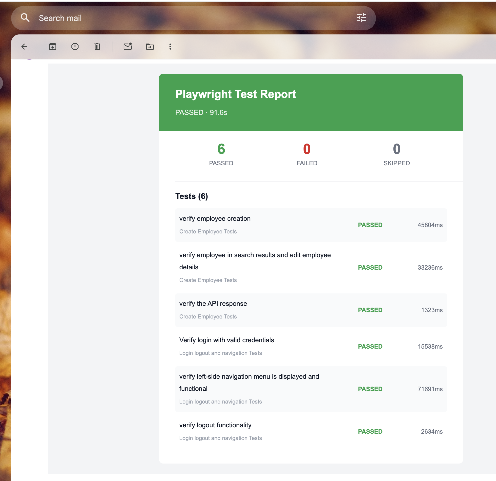

# OrangeHRM Test Automation

End-to-end test automation for the [OrangeHRM](https://opensource-demo.orangehrmlive.com) web application using Playwright and TypeScript.

## What This Project Does

Automates key HR workflows on the OrangeHRM demo application:

- **Login** — Authenticate with valid credentials and verify successful login
- **Navigation** — Verify all left-side menu tabs (Admin, PIM, Leave, Time, Recruitment, etc.) are functional
- **Employee Management (PIM)** — Create employees with optional login credentials, search by ID/name, validate search results, and edit employee details (job title, category, employment status)

## Project Structure

```
config/
  env.ts              # Centralized environment variable loader (dotenv)
  config.ts           # URL builders and app configuration per environment
tests/
  fixtures/           # Playwright custom fixtures (page objects, shared context)
  pageObjects/        # Locator definitions (DOM selectors)
  pages/              # Page action methods (business logic layer)
  specs/              # Test specifications
  types/              # Shared TypeScript types
  utility/            # Helpers (actions wrapper, logger, test data generator)
```

## Libraries Used

| Library                           | Purpose                                               |
| --------------------------------- | ----------------------------------------------------- |
| `@playwright/test`                | Test runner, browser automation, assertions           |
| `dotenv`                          | Loads environment variables from `.env`               |
| `winston`                         | Structured logging to file and console                |
| `@faker-js/faker`                 | Random test data generation (names, IDs, credentials) |
| `@playwright-labs/reporter-email` | Sends test report emails after CI runs                |

## Fixtures

Custom fixtures are defined in `tests/fixtures/testFixture.ts` and extend Playwright's base `test` object:

| Fixture          | Scope       | Description                                                                                |
| ---------------- | ----------- | ------------------------------------------------------------------------------------------ |
| `workerContext`  | Worker      | Shared browser context across tests in a worker — avoids creating a new context per test   |
| `sharedContext`  | Test        | Exposes the worker context at test level                                                   |
| `sharedPage`     | Test        | Creates a page from the shared context; captures console errors and page errors via logger |
| `saveScreenshot` | Test (auto) | Automatically takes and attaches a screenshot on test failure                              |
| `loginPage`      | Test        | Pre-initialized `LoginPage` instance                                                       |
| `dashboardPage`  | Test        | Pre-initialized `DashboardPage` instance                                                   |
| `apiHelper`      | Test        | API utility using the authenticated browser context for REST calls                         |

Usage in specs:

```ts
import { test } from '../fixtures/testFixture';

test('example', async ({ loginPage, dashboardPage }) => {
	await loginPage.openLoginPage();
	await loginPage.login('Admin', 'admin123');
	await dashboardPage.openTab('PIM', 'PIM');
});
```

## Setup

### Prerequisites

- Node.js >= 20
- npm >= 10

### Install

```bash
npm install
npx playwright install
```

### Environment Variables

Create a `.env` file in the project root:

```env
ENV=prod
ADMIN_USERNAME=****
ADMIN_PASSWORD=****
ENABLE_CONSOLE_LOG=true
LOG_LEVEL=info
SMTP_USERNAME=****
SMTP_PASSWORD=****
```

| Variable             | Required | Values                           | Default |
| -------------------- | -------- | -------------------------------- | ------- |
| `ENV`                | Yes      | `dev`, `staging`, `prod`         | —       |
| `ADMIN_USERNAME`     | Yes      | —                                | —       |
| `ADMIN_PASSWORD`     | Yes      | —                                | —       |
| `ENABLE_CONSOLE_LOG` | No       | `true`, `false`                  | `false` |
| `LOG_LEVEL`          | No       | `info`, `debug`, `warn`, `error` | `info`  |
| `CI`                 | No       | `true`, `false`                  | `false` |
| `SMTP_USERNAME`      | No       | Gmail address for sending emails | —       |
| `SMTP_PASSWORD`      | No       | Gmail app password               | —       |

## Running Tests

```bash
# Run all tests
ENV=prod npx playwright test

# Run a specific spec
ENV=prod npx playwright test tests/specs/createEmployee.spec.ts

# Run headed (visible browser)
ENV=prod npx playwright test --headed

# Run with trace enabled
ENV=prod npx playwright test --trace=on

# List discovered tests without running
ENV=prod npx playwright test --list
```

> The `ENV` variable can also be set in `.env` instead of passing it inline.

### View Report

```bash
npx playwright show-report
```

## Logger

Logging is handled by [winston](https://github.com/winstonjs/winston) and configured in `tests/utility/logger.ts`.

### How It Works

- **File transport** — All logs are written to `test-execution.log` in the project root. This is always active.
- **Console transport** — Logs are printed to the terminal only when `ENABLE_CONSOLE_LOG=true` is set. Errors and warnings go to `stderr`, everything else to `stdout` with colorized output.
- **Log level** — Controlled by the `LOG_LEVEL` env variable (default: `info`). Supports `error`, `warn`, `info`, `debug`.
- **Format** — `<timestamp> <level>: <message>` (e.g., `2026-05-11T10:30:00.000Z info: Dashboard is visible`)

### Usage

```ts
import { logger } from '../utility/logger';

logger.info('Navigating to PIM tab');
logger.error('Element not found');
logger.debug('Response payload: ...');
```

### npm Scripts

| Command               | Description                    |
| --------------------- | ------------------------------ |
| `npm test`            | Run all tests                  |
| `npm run test:headed` | Run tests with visible browser |
| `npm run test:trace`  | Run tests with trace enabled   |
| `npm run test:list`   | List all discovered tests      |
| `npm run report`      | Open the HTML test report      |

> Set `ENV` in `.env` or pass inline: `ENV=prod npm test`

## CI/CD

Tests run automatically on GitHub Actions for every push and pull request to `main`/`master`. The workflow is defined in `.github/workflows/playwright.yml`.

### Setup

1. Base64-encode your `.env` file:

   ```bash
   base64 -i .env
   ```

2. In your GitHub repo, go to **Settings → Secrets and variables → Actions** and create a secret named `ENV_FILE` with the base64 output.

3. The workflow decodes the secret into a `.env` file at runtime before running tests.

### What the Workflow Does

- Checks out the code (with full git history for diff detection)
- Installs Node.js and dependencies
- Installs Playwright browsers
- Decodes `ENV_FILE` secret into `.env`
- **On PR** — runs only affected tests using `--only-changed=origin/main`
- **On push to main/master** — runs all tests
- Uploads the HTML test report as an artifact (retained for 30 days)

### Only-Changed Tests on PR

The workflow uses Playwright's `--only-changed` flag to run only tests affected by the PR diff. This reduces CI time by skipping unrelated tests. Full history (`fetch-depth: 0`) is required for git diff comparison.

### Sharding (Parallel CI Runs)

Tests are split across **2 shards** (kept at 2 for demo purposes) that run in parallel as separate GitHub Actions jobs. This cuts CI time roughly in half.

- Each shard runs with `--shard=x/2` and uploads a blob report
- After all shards complete, a `merge-reports` job downloads all blob reports and merges them into a single HTML report
- The merged report is uploaded as an artifact (retained for 14 days)

To increase parallelism, update the `shardIndex` and `shardTotal` values in the workflow matrix:

```yaml
matrix:
  shardIndex: [1, 2] # increase shards here
  shardTotal: [2] # update total shards accordingly
```

### GitHub Pages Report

After each push to main/master, the merged HTML report is automatically deployed to GitHub Pages. View the latest report at:

```
https://amartanwar42.github.io/fabric-qa-code-challenge/
```

### Email Notifications

After all shards complete and reports are merged, an email with the full test results is sent automatically using [`@playwright-labs/reporter-email`](https://github.com/vitalics/playwright-labs/tree/main/packages/reporter-email).

- The email reporter runs during the `merge-reports` CI job (not per shard), so you receive **one consolidated email** with all test results
- Uses Gmail SMTP with an [app password](https://myaccount.google.com/apppasswords) for authentication
- The email template is rendered using React Email (shadcn-styled)
- Configuration is in `merge-reports.config.ts`
- To change the recipient, update the `to` array in `merge-reports.config.ts`.

#### Sample Email


